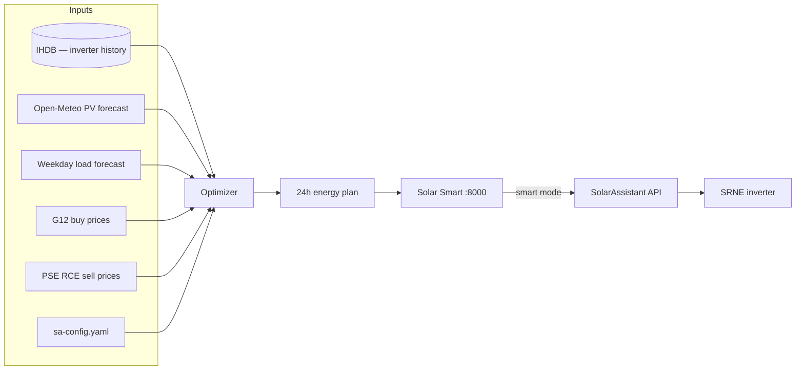

# Solar Smart

Raspberry Pi web app for **energy arbitrage** on an **SRNE** hybrid inverter through the [SolarAssistant](https://solarassistant.com/) REST API. It reads live metrics and inverter history (**IHDB**), builds a cost-aware plan for today and tomorrow, and — with Smart mode on — writes the inverter timer through SolarAssistant.

Solar Smart listens on **port 8000**. SolarAssistant stays on its default port **80**. Buy tariff is **G12** (two zones); export credit is **PSE RCE**.

## Screenshots

| Dashboard — live PV / battery / grid | Rules — SRNE timer | Rules — energy arbitrage plan |
|---|---|---|
|  |  |  |

## How it works



- Every **15 minutes** the app rebuilds the plan for the rest of today and tomorrow from live load, battery SOC, weather, and prices.
- **Finished hours** stay on **IHDB** measurements. The **current hour** keeps the action and timer chosen at `:00`; only measured PV, load, and SOC catch up during the hour. Later hours are replanned when forecasts or prices change.
- The optimizer schedules grid import, battery charge, and export to lower the **G12 bill**, within battery limits: cheaper imports, export when RCE is worth it, enough reserve for the night and the next sunny hours.
- With **Smart mode** on, at the **start of each hour** the Pi writes that hour’s timer to SolarAssistant and keeps work mode aligned with the plan. Smart mode is **off by default**; the plan and monthly history work without writing to the inverter.

## Product

- **Dashboard** — live PV, load, battery, grid; energy overview from IHDB.
- **Power Management** — scale PV and consumption forecast totals up to 2 days ahead. Saved in config, applied to the plan. Cleared overnight so the next day starts from fresh forecasts.
- **EV Charging** — day and night charge windows (time and power) up to 2 days ahead. Enabled windows add load to the forecast. Past EV sessions are excluded from the weekday load profile.
- **Energy arbitrage** (Rules) — rolling today + tomorrow: planned action, grid import/export, battery SOC, estimated costs.
- **Timer Schedule** (Rules) — view and edit SRNE charge/discharge slots. With Smart mode on, the Pi applies the plan automatically.
- **Monthly history** — closed calendar months from IHDB: daily production, import, export, Energy Cost, Service Cost, and the running **Energy Deposit Total**.

### Plan cost columns

| Column | Meaning |
|--------|---------|
| **G12 zone / buy price** | Peak or off-peak zone and full G12 buy rate (PLN/kWh brutto) |
| **RCE price** | PSE day-ahead export credit under net-billing (brutto PLN/kWh) |
| **Energy Cost** | Energy (obrót): import at the G12 energy component minus export credited at RCE. Positive in the UI means export credit exceeds energy import. |
| **Service Cost** | Distribution and other non-energy fees on grid import only. Not offset by export. |

**Energy Deposit Total** is the running net-billing credit pool in PLN: export at RCE adds to the pool; grid import energy is settled from the pool first until it runs out. Credits carry across months. Service Cost is not paid from this pool.

### Smart mode → inverter

| Planned action | Effect in SolarAssistant |
|----------------|--------------------------|
| **Charging from Grid** | Timed grid charge in the planned window |
| **Discharging to Grid and Load** | Timed discharge and grid export in the planned window |
| **Other** | No timed charge/discharge |

## Install on the Pi

Needs Raspberry Pi with SolarAssistant (IHDB on the same machine), Python 3.11+, SRNE visible in the SolarAssistant discovery API, and the SA web password in config.

```bash
git clone <repository-url>
cd solar-assistant
cp sa-config.yaml.example sa-config.yaml
# edit sa-config.yaml — site, battery, G12 prices, sa.password
bash install.sh
```

UI: `http://<pi-ip>:8000/` — **Energy arbitrage** is the plan; **Timer Schedule** mirrors SolarAssistant.

Enable Smart mode in Rules → Timer Schedule, or:

```bash
curl -X POST http://<pi-ip>:8000/api/smart-mode \
  -H "Content-Type: application/json" \
  -d '{"enabled": true}'
```

On enable, Solar Smart syncs immediately. The plan still refreshes every 15 minutes; the inverter timer is written at the start of each hour while Smart mode stays on.

## Service and logs

```bash
sudo systemctl status smart
bash scripts/reload-smart.sh
journalctl -u smart -n 100 --no-pager
```

Daily files: `logs/YYYY/MM/YYYY-MM-DD.log` (Europe/Warsaw).

`install.sh` copies unit files from `systemd/` into `/etc/systemd/system/` (`smart.service` plus boot-guard timer) and keeps SolarAssistant on port 80. Do not point SolarAssistant at 8000.

## Deploy from Windows

```powershell
.\sync-to-pi.ps1
```

Copies app code and reloads `smart`. **`sa-config.yaml` on the Pi is not overwritten.**

## Local development (Windows)

```powershell
py -m venv .venv
.\.venv\Scripts\pip install -r requirements.txt
copy sa-config.yaml.example sa-config.yaml
copy sa-config.local.yaml.example sa-config.local.yaml
# sa-config.yaml: same site settings as the Pi (including sa.password)
# sa-config.local.yaml: sa.host = Pi LAN IP

.\scripts\run-local.ps1
```

Uses `sa-config.yaml` plus optional `sa-config.local.yaml` and an SSH tunnel to Pi IHDB. Stop with `.\scripts\stop-local-smart.ps1`.

## Configuration

| File | Purpose |
|------|---------|
| `sa-config.yaml` | Site config (gitignored; same file on Pi and Windows) |
| `sa-config.yaml.example` | Template for a new install |
| `sa-config.local.yaml` | Optional Windows overlay (gitignored); typically `sa.host` |

Minimum in `sa-config.yaml`: `location`, `solar.blocks`, inverter/battery sizes, `simulation.min_soc_pct`, `grid.g12` prices, `sa.host`, `sa.password`. Copy from `sa-config.yaml.example` — that file uses placeholders, not a live site.

Other flags:

- `smart_mode_enabled` — write timers to SolarAssistant
- `debug_tab_enabled` — Debug tab in the UI
- `simulation.losses_pct` — conversion losses (percent); default **7.5%** on each path

Do not commit `sa-config.yaml` or `sa-config.local.yaml`.

## License

MIT — see [LICENSE](LICENSE).
